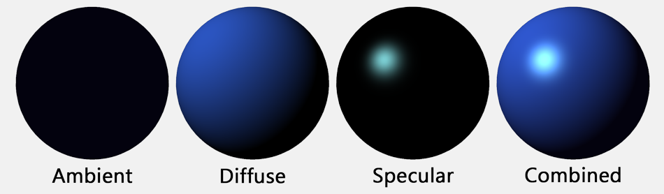
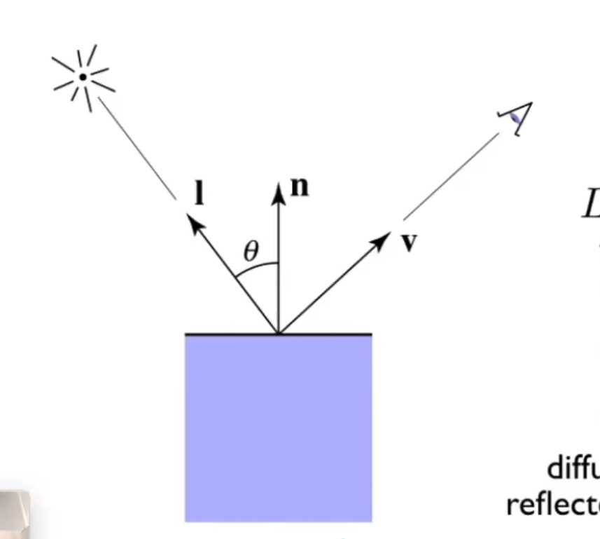
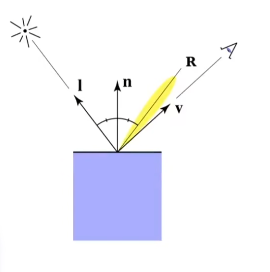
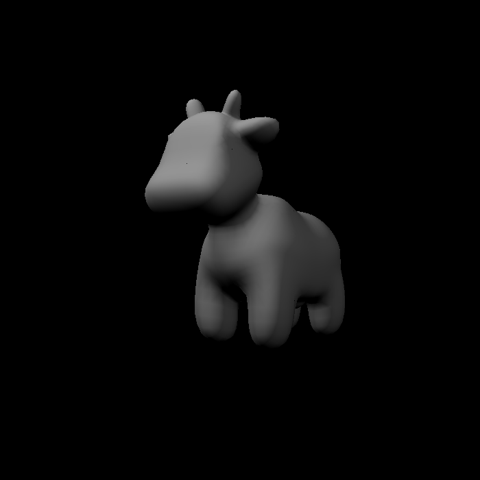
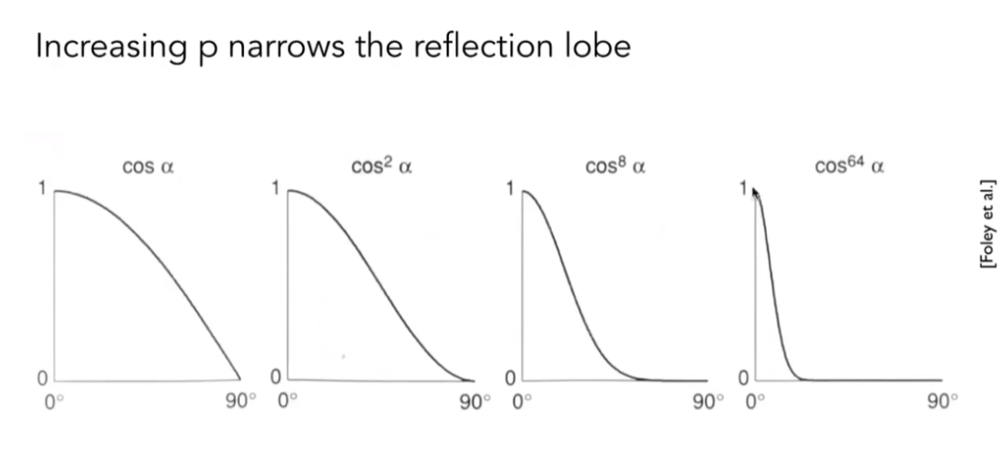
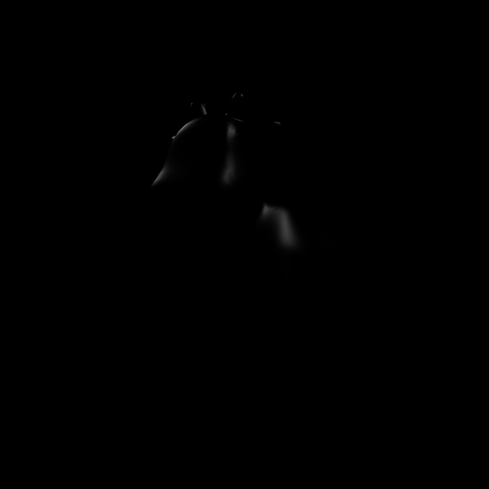
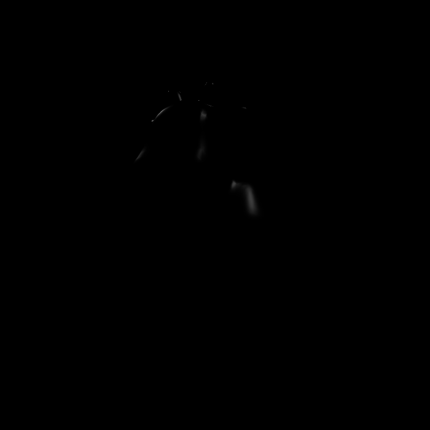
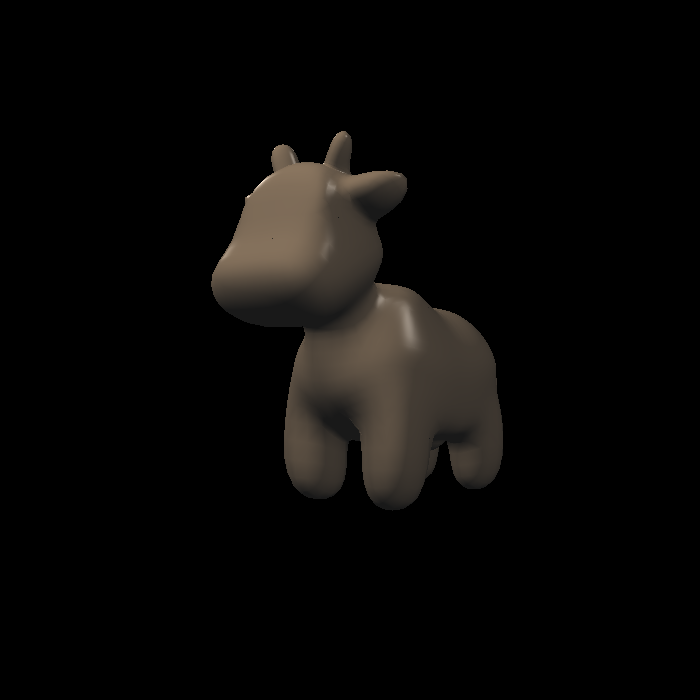

# Blinn-Phong 模型介绍

Blinn-Phong 模型是一种着色模型。该模型将光照对物体的作用分成三部分

1. 漫反射
2. 高光
3. 环境光

## 漫反射

首先定义光源的强度为$I$、慢反射中着色点吸收光照的系数$k_d$

漫反射不考虑观察者的观察角度。只考虑光源的入射角度以及着色点法向量的位置

$$
\mathrm{diffuse} = k_d\cdot (I/r^2) \mathrm{max}(0, \mathbf{l}\cdot \mathbf{n})

$$
由于光线入射角度和着色点方向量的夹角的余弦可以是一个负数，这没有意义。所以这里取$\mathrm{max}(0, \mathbf{l}\cdot \mathbf{n})$

## 高光

我们会看到高光主要是因为观察的角度和光线反射的角度接近。因此衡量一个地方的高光主要就是看观察角度和入射角度的接近程度

我们这里将反射光线的出射方向向量记作$\mathbf{R}$。可知观察角度和出射角度的接近可以由$\mathbf{R}\cdot \mathbf{v}$来表述

由于计算 $\mathbf{R}$ 相对比较复杂。在 Blinn-Phong 模型中，提出了一种优化方法：不直接计算 $r$ 转而计算法向量和半角向量的接近程度

半角向量就是$\frac{\mathbf{l} + \mathbf{v}}{{\|\mathbf{l} + \mathbf{v}\|}}$记作$\mathbf{h}$。当观察方向和出射方向相同时可以知道半角向量和法向量方向相同

现在，得到计算高光的公式如下：

$$
\mathrm{specular}=k_s\cdot (I/r^2)\cdot \mathrm{max}(0,\mathbf{n}\cdot \mathbf{h})
$$

### 处理高光的大小显示

还有一个问题是，毕竟 blinn-phong 是一个经验模型。换而言之就是不够准确。如果直接用上述公式，就会得到一个很大的高光

这是因为 $\mathbf{n}\cdot \mathbf{h}$ 也就是两个方向向量的余弦$\cos{\alpha}$ 变化过于平缓

需要给cos加上一个指数 $alpha$

$p=64$

$p=150$

## 环境光

环境光和直接光照的方向不一样，他和光线的位置和观察的方向都没有关系。只和着色点的吸收光照的系数以及和光照强度有光

$$
\mathrm{ambient}=k_a \cdot I
$$

## 结合

将漫反射、高光、环境光结合起来，最终就得到了 Blinn-Phong 模型

$$
\mathrm{color}= \text{diffuse} + \text{ambient} + \text{specular}
$$

