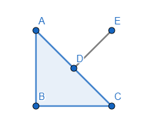
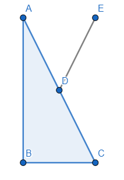

## 问题

在光栅化阶段，顶点会经 model-view 矩阵的变换，从模型空间转变到相机空间，而法向量不能直接通过 model-view 矩阵的变换。这是因为MV矩阵可能导致法向量和该点不会垂直

---

这里假设变换矩阵是将纵向拉伸两倍，由于横向保持不变，因此法向量也不在垂直于三角形的斜边

---

现在的问题就是如何求解法向量的变换矩阵

假设模型空间的切向量是 $t$ 法向量是 $N$，在相机空间的切向量是$t'$ 法向量是 $N'$

可知 $N$ 和 $t$ 正交, $N^T\cdot t = 0$,$N'^T\cdot t'=0$

通过上面两个条件，经过变换可知 $N'^T\cdot (M\cdot t) = 0$

$$
N'^T\cdot M = N^T \\
(M^T\cdot N')^T = N^T\\
N'= (M^T)^{-1}N
$$

由于变换矩阵是可逆矩阵，因此转置矩阵的逆矩阵等于逆矩阵的转置矩阵

$$
N' = (M^{-1})^T\cdot N
$$
